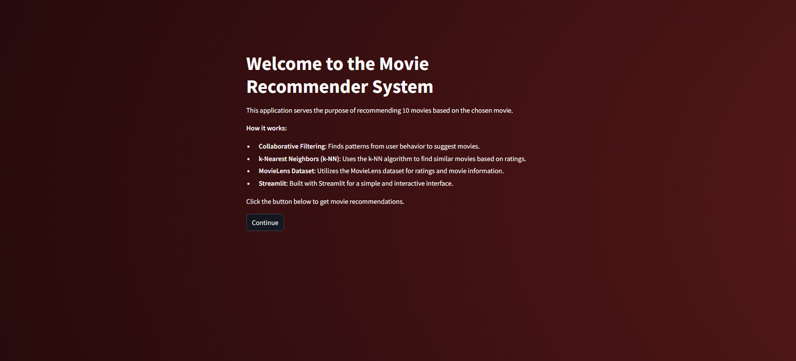
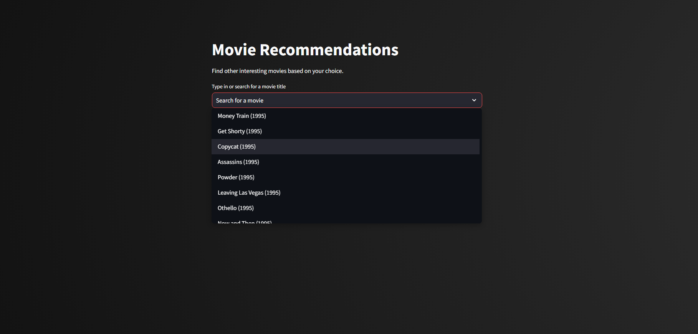
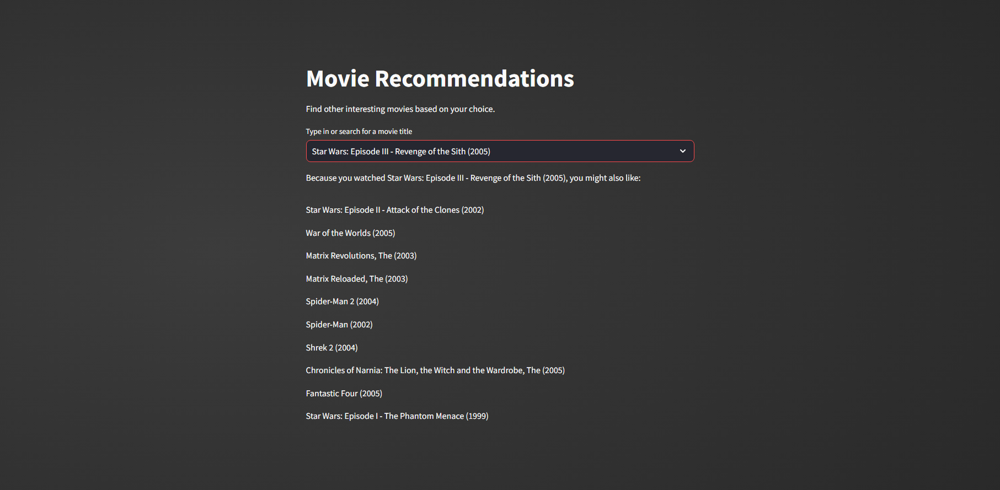

# Movie Recommender System

This is a movie recommender system built using Python, the MovieLens dataset, and Streamlit.

## Setup

1. **Install the dependencies:**
    ```sh
    pip install -r requirements.txt
    ```

2. **Run the Streamlit app:**
    ```sh
    streamlit run app.py
    ```

## Project Structure

- `main_folder/`
  - `recommender.py`: Contains the `Recommender` class and related functions.
  - `requirements.txt`: List of required Python packages.
  - `app.py`: Contains the Streamlit app for the movie recommender system.
  - `data/`: Directory containing the datasets.
    - `movies.csv`: Dataset with movie information.
    - `ratings.csv`: Dataset with user ratings for movies.
  - `README.md`: Project documentation and setup instructions.

## How It Works

- **Collaborative Filtering**: The system uses collaborative filtering to identify patterns in user behavior and suggest movies based on these patterns.
- **k-Nearest Neighbors (k-NN)**: The k-NN algorithm is used to find similar movies based on user ratings.
- **MovieLens Dataset**: Recommendations are based on the MovieLens dataset, which includes a large number of movie ratings and metadata.
- **Streamlit**: The web application is built using Streamlit, providing a simple and interactive interface for users.

## Usage

1. **Launch the Streamlit app:**
    ```sh
    streamlit run app.py
    ```

2. **Navigate to the app in your browser** (usually at `http://localhost:8501`).

3. **Interact with the app** to get movie recommendations. Start by selecting a movie you like from the dropdown menu to see similar movies.

Here is an example of how to interact with the recommender system:

1. **Home Page**: The home page provides an overview of the recommender system.



2. **Recommendations Page**: Select a movie from the dropdown menu 



and get recommendations for similar movies.



## Acknowledgements

- The MovieLens dataset is provided by the [GroupLens research group](https://grouplens.org/datasets/movielens/).
- Streamlit is an open-source app framework for Machine Learning and Data Science projects.
